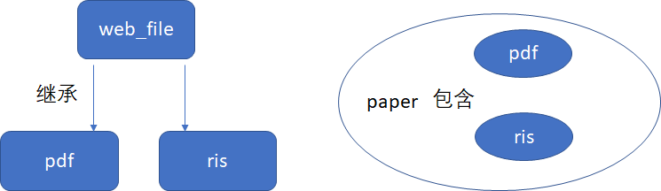

# 单篇文献抓取工具（目前只支持Science和Nature下面的网页）

## 背景

现在虽然有很多文献管理工具，例如Endnotes，但是无疑使用原始的文件夹+pdf的方式更加兼容多平台，这种方式配合坚果云等多设备同步使用非常方便。但是我们平常去浏览器中下载文件，文件名经常是随意的，而且下载的位置经常是放在默认目录下面，事后我们还要对其进行文件夹归档，这次的作业我们就是为了部分解决这个问题。

## 思路

解决的思路分成三步：

1. 从网站上面把pdf文档和配套的ris文档下载下来
2. 利用 ris 文档中的信息修改 pdf 文档的文件名以及ris 文档的名称
3. 根据用户给出的信息将 ris 文件和 pdf 文件移动到合适的文件路径

## 使用方法

```python
# main.py
from utils import paper # 导入papar class

web_url = "https://www.nature.com/articles/s41586-021-03359-9" #指定文献的网址

pdf_directory = r"G:\\Test_Download_paper\\PDF" # 指定pdf存放的目录
ris_directory = r"G:\\Test_Download_paper\\RIS" # 指定ris存放的目录

paper1 = paper(web_url, pdf_directory= pdf_directory, ris_directory= ris_directory) 
paper1.download() 
```

## 代码结构

项目包含以下内容：

- /main.py 运行程序
- /RisOperation.py 用于处理ris文件的的函数包
- /HtmlParser.py 用来解析HTML，从HTML中提取出网页中文件的链接
- /settings.py 保留文件，用于之后配置应用(之后可能会改成.json格式)，目前是空的
- /app_gui.py 用于之后开发应用的图形界面
- /utils.py 里面定义了我们使用到的类

### 代码API

#### HtmlParser.py

```
get_url(filter, web_url ,soup=None)
从web_url上抓取HTML,利用filter正则表达式从HTML含有的链接中取出一个链接并返回，如果你已经抓取下来网页并将其转化为BeautifulSoup的格式，你也可以选择将其传入，这样我们将放弃从web_url上进行抓取，但是web_url还是要传入，因为soup中并不包含网页的url信息
```

```
def check_link(link)
为了保证最后的链接只有一个，检查link中的元素个数，为1返回1，为0返回0，大于1返回-1，这个后续会添加更进一步的功能对我们的链接进行更进一步的检查
```

#### utils.py

主要定义了4个类，web_file, pdf, ris, paper，下图是它们的关系



##### class web_file

这个是为网页上面所需要下载的文件所定义的类，类中的方法可以下载该文件，返回文件的路径，以及对文件进行重命名

```
web_file 属性：
url 文件的url地址
name 不包含后缀的文件名
postfix 文件后缀名
directory 文件放置的目录
```

```
web_file.__init__(self, url=None, name="temporary", postfix = None, directory = None)
设置url属性为传入的url，
name属性为传入的name,
postfix属性为传入的postfix
directory属性如果传入None则设置为当前文件夹，否则设置为传入的directory
```

```
web_file.download(self, link = None , path = None )
根据link给出的url下载文件，下载文件的放置的路径设置为path(包含文件名的完整路径)
如果link是None则使用url属性为下载地址，如果path是None则使用method path生成的路径
```

```
web_file.rename(self, newname)
将文件的名字设置为newname,newname不包含后缀名，此函数必须在文件已经存在的情况下使用
```

```
web_file.path(self)
返回文件的当前路径，果文件还没有下载时是其将要放置的路径，返回类型是str
```

##### class pdf

为pdf文件设置的类，从class web_file继承下来的

```
pdf.__init__(self, directory = None)
设置文件后缀属性，设置directory属性
pdf.url_get(self,web_url)
这个函数从web_url中解析出pdf的下载链接
```

##### class ris

为ris文件设置的类，从class web_file继承下来的

```
ris.__init__(self, directory = None)
设置文件后缀属性，设置directory属性
ris.url_get(self,web_url)
这个函数从web_url中解析出pdf的下载链接，返回下载链接的字符串(str格式)
```

##### class paper

为将要下载的文献建立了一个类，里面包含了一个ris类的属性，一个pdf类的属性

```
paper 属性：
url 文章的网页链接
pdf_dir 放置文章的pdf的目录路径
ris_dir 放置文章的ris的目录路径
```

```
paper.__init__(self, web_url, pdf_directory = None, ris_directory = None)
设置放置pdf的目录路径与放置文章的ris的目录路径
```

```
paper.download(self)
从文章网页链接上取得pdf和ris文件的链接并且将其下载下来
```

#### RisOperation.py

```
generate_name_from_ris(ris_path)
从ris_path路径给出的ris文件中生成合适的文献名字，返回文献名字(str格式)
```

## 遇到的问题：

1. requests的文档中包含了很多我现在不需要用的内容，初期主要是讲怎么从服务器请求数据，但是我对一般的http数据请求一无所知，应该找一个爬虫的示例来得快些。（[爬虫示例](https://www.jianshu.com/p/da98e3ca8e50)）

2. 使用了如下的代码，但是不知道得到的对象里面存放的是什么东西

   ```python
   r = requests.get('https://api.github.com/events')
   dir(r) # 这个给出了一堆属性但是不知道每个表示什么
   #后面去查了一下开发接口，稍微明白了一点，我们主要爬取到的数据就放在raw, text, content 这三个属性里面，只不过编码方式不一样
   ```

3. 之后分析网站上面的html文档遇到一定困难，主要网站的html文档很长，对于html文档我不是特别清楚

   解决办法：去菜鸟教程上面粗略了解了一下html, css, javascript各自大致的内容后大概对html里面的结构有了一个了解，之后结合浏览器提供的html的调试工具，主要是元素选择器边看边想大概懂了，不过用时比较久

4. 接下来我需要从抓取到的html文档中把pdf文档的 url 和 ris文件的 url 提取出来，需要学习bs4中的过滤器，另外利用元素选择器点击文献下载的按钮可以很快帮我定位 url 在 html 中相关的代码。

5. 遇到一个bug，这个同时运用tag和text进行搜索时，我发现下面例子中第二个文本里面含有Do的tag是不能被检验出来的

   ```python
   html_doc = """
   <html><head><title>The Dormouse's story</title></head>
   
   <p class="story">
   <a>Download citation</a>
   <a>Download citation
   <br>
   </a>
   </p>
   """
   
   from bs4 import BeautifulSoup
   soup = BeautifulSoup(html_doc)
   soup.find_all("a",text=re.compile("Do*"))
   # 输出结果
   #[<a>Download citation</a>]  
   ```

6. 之后文本处理没有找到合适的库进行处理，不想自己造轮子，我需要从ris文件里面将作者之类的信息给解析出来，运用C语言通常的处理办法一个个读字符肯定是不合适的，但是网络上面搜素python文本处理得到的搜索结果很乱，大多数也都是一行行进行处理，这里实际上我是想找一个轮子而不是自己去写底层的行处理来进行数据的解析，之后换用搜素式子“python 解析 ris"[找到一个包](https://pypi.org/project/RISparser/)，之后我查看了这个包的源码学习了一下文件处理。

## 个人体会

写到后面的时候体会都忘得差不多了。。。。

现在印象最深的是感觉使用文档好难写，虽然看别人写的使用文档会觉得又臭又长或者太简短了根本什么都看不懂，但是轮到自己写就感觉到了困难，很难在一份API文档中间把整个代码的架构体现出来，感觉API文档主要还是给较为熟悉这一部分人或者是直接看源码的人使用的，真正要做到向不看源码的使用者清晰讲解用法的文档还是使用一些典型的例子比较方便。

再者是感觉用到的知识虽然都很简单，但是查找到相应的操作却是需要需要花不少时间的，简单的常使用的功能是很容易找到的，难找的是那些需要那么几个小功能拼接起来的功能的代码片段是比较难查询的，很多时候你以为会有一条简单的代码一键实现你的功能所以你找了很久但是没有找到，或者你的要找的功能比较庞大所以网站上是很难出现符合你需求的代码的，有时候感觉这是一种权衡，自己是知道怎么用复杂的方法或者不优美的代码处理这个问题的，但是就是想要在网站上面找一点好用的轮子，当检索的方式不太正确的时候往往找不到，有时候功能比较小的话反而比起自己实现要更慢，找的时间太久了可能更是有一种挫败感（但是轮子是真的好用！！）

因为是边学边用所以在初期的时候总是要做一些代码的测试来验证自己的认知是否和真实情况相同，之前偷懒不想创建新的文件所以直接在Vscode的命令行窗口里面直接进行测试，没有补全与高亮体验很差，而且不方便修改，后面改用vscode打开jupyter notebook进行测试真的方便了好多，顺带吐槽一下vscode的jupyter插件的补全还是有时候没有。。。。。


## 下一步

因为时间比较紧所以代码中暂时没有写图形界面，在关键节点上面我们没有进行一些错误的检测与处理

- 添加图形界面
- 添加错误处理


