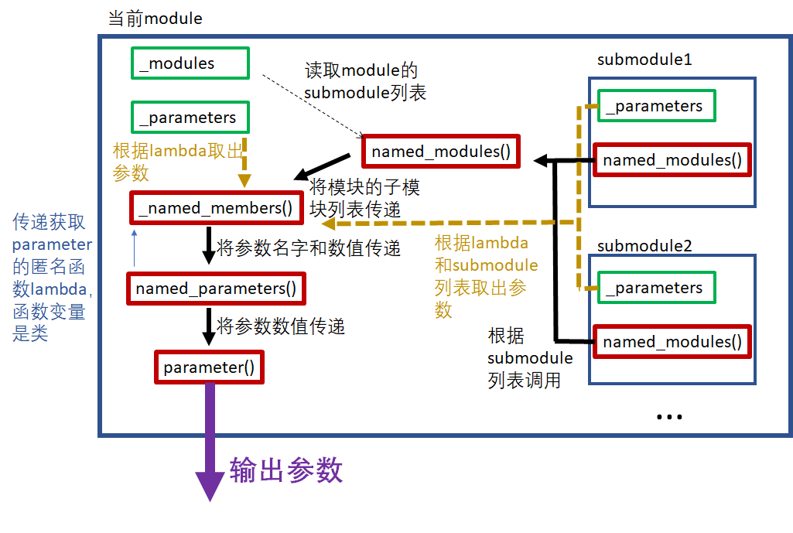

## 问题的起源

我们希望能有一个Method来获取Module类中的参数，获取的情形有两种，一种是我们需要当前module及其子module的所有参数，一种是我们仅仅需要当前module的参数，方便地获取这些参数能够让我们方便地对参数进行更改

## 解决方案的基本原理和实现过程

### 存放参数和子模块列表

Module类中包含两个私有属性

```python
class Module(...):
	def __init__(self):
		self._parameters = OrderedDict() #用于储存参数
		self._modules = OrderedDict()# 用于储存模块的所有子模块列表
		...
	...
```

其以OrderedDict类的形式将module的参数以及子模块列表存放起来

需要两个方法分别存放参数parameter和submodule列表

### 输出参数

整体的思路是我们先拿到module的子模块列表，将子模块列表中所有模块的的参数全部给出就行了，当然为了避免重复我们需要在整个过程中维护一个集合来给出我们哪些module的参数被输出了。可以看到整个过程非常适合用套娃的方式实现，我们只需要在这个类当中实现大概两个方法即可。

- 获取module所有子module的方法，记为submodule

  从_modules属性中获取当前module的所有直属子module，再调用直属子module的submodule方法获取直属子module的子module，不断递归给出所有module

- 获取module中参数的方法，记为parameter
  这个函数调用上面获取module所有子module的方法之后获得一个module的列表，先将当前module的参数，再调用列表中除当前module的每个module的parameter方法输出每个module的参数

上面的两个方法都应该传递一个参数memo，其是一个集合，用于避免重复

## 调用图(省略了memo)



## 主要函数功能以及具体实现细节解析

### 存放参数和子模块列表

#### Module.add_module() 

```python
 #Module.add_module()
    def add_module(self, name: str, module: Optional['Module']) -> None:
        r"""Adds a child module to the current module.

        The module can be accessed as an attribute using the given name.

        Args:
            name (string): name of the child module. The child module can be
                accessed from this module using the given name
            module (Module): child module to be added to the module.
        """
        if not isinstance(module, Module) and module is not None: #检查module是不是空的，检查其是不是Module类
            raise TypeError("{} is not a Module subclass".format(
                torch.typename(module)))
        elif not isinstance(name, torch._six.string_classes): #检查名称是不是torch._six.string_classes类
            raise TypeError("module name should be a string. Got {}".format(
                torch.typename(name)))
        elif hasattr(self, name) and name not in self._modules: #检查我们是不是已经将其加入到_modules当中了
            raise KeyError("attribute '{}' already exists".format(name))
        elif '.' in name: #检查名称中是否含有.,含有.说明名称不规范
            raise KeyError("module name can't contain \".\", got: {}".format(name))
        elif name == '': #名称不能为空
            raise KeyError("module name can't be empty string \"\"")
        self._modules[name] = module #以键值对的形式将其添加到_modules中
```

我们以注释形式完成了说明。

#### Module.register_parameter()

```python
#Module.register_parameter()
    def register_parameter(self, name: str, param: Optional[Parameter]) -> None:
        if '_parameters' not in self.__dict__: # 检查我们是否有_parameters属性用来放置参数
            raise AttributeError(
                "cannot assign parameter before Module.__init__() call")

        elif not isinstance(name, torch._six.string_classes):#检查名称是不是torch._six.string_classes类
            raise TypeError("parameter name should be a string. "
                            "Got {}".format(torch.typename(name)))
        elif '.' in name: #检查名称中是否含有.,含有.说明名称不规范
            raise KeyError("parameter name can't contain \".\"")
        elif name == '':  #名称不能为空
            raise KeyError("parameter name can't be empty string \"\"")
        elif hasattr(self, name) and name not in self._parameters: # 如果名称在_parameters中没有注册但是我们的属性中又使用了这个名称，那很可能这个名称不是给参数用的，需要报错
            raise KeyError("attribute '{}' already exists".format(name))

        if param is None:
            self._parameters[name] = None #空参数？？？
        elif not isinstance(param, Parameter): # 检查参数类型是否正确
            raise TypeError("cannot assign '{}' object to parameter '{}' "
                            "(torch.nn.Parameter or None required)"
                            .format(torch.typename(param), name))
        elif param.grad_fn: # 在这个里面由于是自动求梯度，我们的梯度来源必须是程序自动生成的
            raise ValueError(
                "Cannot assign non-leaf Tensor to parameter '{0}'. Model "
                "parameters must be created explicitly. To express '{0}' "
                "as a function of another Tensor, compute the value in "
                "the forward() method.".format(name))
        else:
            self._parameters[name] = param #以键值对的形式将其添加到_parameters中
```

### 输出参数和子模块列表

#### Module.parameter()

先看Module.parameter()

```python
#Module.parameter()
def parameters(self, recurse: bool = True) -> Iterator[Parameter]:
     for name, param in self.named_parameters(recurse=recurse):
            yield param
```

其调用了Module.named_parameters()方法给出的迭代器来进行枚举，其将recurse参数传递下去指示是否要将子module的参数也显示出来

#### Module.named_parameters()

```python
#Module.named_parameters()
	def named_parameters(self, prefix: str = '', recurse: bool = True) -> Iterator[Tuple[str, Parameter]]:
        gen = self._named_members(
            lambda module: module._parameters.items(),#这个函数以module作为变量，将module里面的参数_parameters以元组的形式给出来
            prefix=prefix, recurse=recurse)
        for elem in gen:
            yield elem
```

上面方法里面又调用了Module._named_members()方法给出的迭代器进行枚举，调用过程中其传递了一个匿名函数，这个函数以module作为变量，将module里面的参数 _parameters以元组的形式给出来，同时其将recurse参数传递下去指示 Module. _named_members()是否要将子module的参数也显示出来

#### Module._named_members()

```python
#Module._named_members()
    def _named_members(self, get_members_fn, prefix='', recurse=True):
        r"""Helper method for yielding various names + members of modules."""
        memo = set() #这个用于记录我们已经输出了哪些module里面的参数
        #下面变量modules用于说明我们需要哪些module的参数,如果recurse为true则利用Module.named_modules()方法给出所有的子module的列表，表明我们要所有子module的参数，如果recurse是False则只把自身添加进去
        modules = self.named_modules(prefix=prefix) if recurse else [(prefix, self)] 
        for module_prefix, module in modules:
            members = get_members_fn(module) #利用函数get_members_fn获取module模块中的参数
            for k, v in members:
                if v is None or v in memo: #防止重复输出
                    continue
                memo.add(v)
                name = module_prefix + ('.' if module_prefix else '') + k
                yield name, v
```

上面利用注释给出了解释，总的来看此方法思路是

1. 将需要的参数相对应的module参数列表给出来
2. 依次利用获得的列表里面每个module的内置的获取参数的方法给出全部我们要的参数

其调用了Module.named_modules()给出的迭代器给出module的子模块，利用Module._parameters.items()给出模块中参数的元组表示形式

#### Module.named_modules()

```python
#Module.named_modules()
    def named_modules(self, memo: Optional[Set['Module']] = None, prefix: str = ''):
        if memo is None:
            memo = set() #这个用于记录我们已经输出了哪些module
        if self not in memo:
            memo.add(self)
            yield prefix, self #保证module自己输出，因为自己是自己的子模块
            for name, module in self._modules.items(): #子模块被记录在_modules属性当中
                if module is None:
                    continue
                submodule_prefix = prefix + ('.' if prefix else '') + name
                for m in module.named_modules(memo, submodule_prefix): #给出子模块的子模块
                    yield m
```

总结这个方法的思路是：

1. 利用memo集合记录所有已经被输出的module防止重复输出，这个memo会在整个输出过程中被共享，即输出子模块的子模块时我们参考的module的list仍然是这个
2. 如果自己不在memo上面将自己输出，同时调用子模块的named_modules()方法输出子模块的子module，调用时将memo传递下去确保我们整个输出过程里面始终是参考memo来确认哪些模块输出了

## 总结

​	pytorch的上面的代码写得很清晰，虽然刚刚开始看觉得有些套娃，比如原则上实现这个功能只需要简洁的两个函数，但是总的来看用了四个方法来实现这个功能，比如Module.parameter()和Module.named_parameters()感觉Module.parameter()就是一层封装，不过后面想想也许可能有必要，毕竟我们不是什么时候都需要参数名字，如果这两个功能都用得很多的话还是有必要区分一下的。

​	Module._named_members()感觉设计得很不错，这个用来抓取module及其所有子module的某个属性时特别好用，只需要传入如何获得属性的匿名函数就可以使用这个方法抓取，节省了很多代码量。

​	感受是理清思路对代码特别有帮助，有时候知道思路都不需要看代码的具体内容就可以知道在写什么，当然这样并未完全看懂代码，其中一些类型的转换，传递的时候参数的类型什么严谨考证我是没有做的，这些在实现的时候是同样重要的。

​	写报告的时候觉得表达能力很匮乏，虽然有时候脑子里面知道逻辑顺序是这样的，但是要用语言来进行表述时候往往觉得过于繁琐，平常看别人的文档时候会抱怨没有写清楚，但是让自己写文档就能感受到写文档不容易，一方面要暴露足够多的细节让读的人能够读懂，一方面又要避免斤斤计较，逐字逐句地进行讲解，感觉在这方面是很难取舍的。另外就是表述的符号和语言方面，感觉当程序写的层数过多或者逻辑比较复杂时，文档就会很难写，比如其调用了十个函数，一个彼此调用的结果又会影响又会影响彼此调用的参数时，这时候往往就觉得叙述困难。

​	总的来说，觉得编程是复杂度高的工作，好的程序员能够按照逻辑与规律将代码组织起来从而降低复杂度，从而使文档代码好写易读。