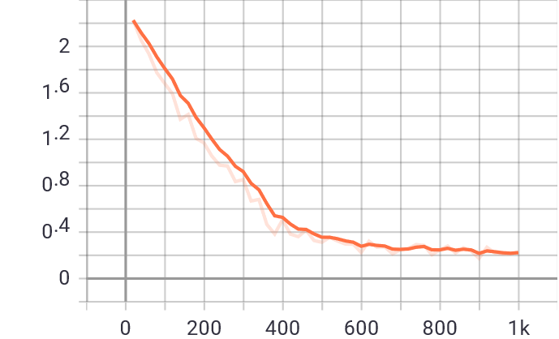

# Mask RCNN 

## 文章翻译

### 摘要

我们提出了一个概念上简单、灵活和通用的对象实例分割框架。我们的方法能有效地检测图像中的对象，同时为每个实例生成高质量的分割掩码(Mask)。这种方法称为 Mask R-CNN，是通过添加一个分支来扩展 Faster R-CNN，该分支用于预测对象掩码，且并行于与现有的用于边界框识别的分支。 Mask R-CNN训练简单，并且相比于Faster R-CNN 只增加了很小的成本，运行速度为5 fps。 此外，Mask R-CNN很容易推广到其他任务，例如，允许在同一框架中猜测人体姿势。我们在 COCO 任务系列的所有部分，包括实例分割、边界框对象检测、和人物关键点检测三个方面，都取得了最佳结果。 Mask R-CNN在每项任务上都优于所有现有的单模型方法，包括 COCO 2016 挑战赛的获胜者。我们希望这一简单而有效的方法将作为一个坚实的基础，让未来实例识别的研究变得更加容易。https://github.com/facebookresearch/Detectron

### 引言

计算机视觉研究在短时间内迅速改进了对象检测和语义分割的结果。在很大程度上，这些进步是由强大的基础系统驱动的，例如分别用于对象检测和语义分割的 Fast/Faster R-CNN 和完全卷积网络(FNC)框架。这些方法在概念上是直观的，具有灵活性和稳健性以及更短的训练和推理时间。而我们在这项工作中的目标是为实例分割开发一个相对支持的框架。

实例分割是具有挑战性的，因为它需要正确检测图像中的所有对象，同时精确分割每个实例。因此它结合了两种元素，一是经典计算机视觉任务中的对象检测元素，其用于对单个对象进行分类，并使用边界框来定位每个对象，二是语义分割元素，其目标是将每个像素分类到一组固定的类别中，而不区分对象实例。鉴于此，人们可能会认为需要一种复杂的方法来获得好的结果。然而，我们展现了一个十分简单、灵活且快速的系统，可以超越现有的实例分割结果。

我们的方法称为 Mask R-CNN，是 Faster RCNN 的拓展，另添加了一个分支来预测每个感兴趣区域 (Rol)上的分割掩码，其并行于现有的用于分类和边界框回归的分支。新的掩码分支实际上是应用于每个感兴趣区域的小型完全卷积网络，以像素到像素的方式预测分割掩码。 相比于 Faster R-CNN 框架，Mask R-CNN 易于实现和训练，这将有助于一系列灵活的架构设计。此外，掩码分支仅增加了很小的计算成本，从而可以实现快速系统和快速实验。原则上，Mask R-CNN 是 Faster R-CNN 的直观扩展，但正确构建掩码分支对于获得良好结果至关重要。最重要的是，Faster R-CNN 并不是为网络输入和输出之间的像素对齐而设计的。 这在 RoIPool（用于处理实例的核心操作）如何执行粗略的空间量化以进行特征提取中体现的最明显。为了修复像素非对齐，我们提出了一个简单的、无量化的层，称为 RoIAlign，它原本的地保留了精确的空间位置。尽管这看似是很小的变化，但RoIAlign 有很大的影响：它将掩码准确度提高了10% 到50%，在更严格的定位指标下有更优良的结果。其次，我们发现将掩码和类别预测解耦至关重要：我们独立地为每个类别预测一个二元掩码，类别之间没有竞争，并依靠网络的 RoI 分类分支来预测类别。相比之下，FCN 通常对每个像素执行多种类分类，将分割和分类结合起来，并且根据我们的实验，在实例分割方面效果不佳。

Mask R-CNN 在 COCO 实例分割任务上超越了以前所有最先进的单模型结果，包括 2016 年竞赛获胜者的精心设计的参赛作品。作为副产品，我们的方法在 COCO 对象检测任务上也表现出色。 在切除实验中，我们评估了多个基本实例，这能够证明其稳健性并分析核心因素的影响。

我们的模型可以在 GPU 上以每帧约 200 毫秒的速度运行，而在 COCO 上的训练在单个 8-GPU 机器上需要一到两天的时间。我们相信快速的训练和测试速度，以及框架的灵活性和准确性，将有利于并简化未来对实例分割的研究。

最后，我们通过 COCO 关键点数据集上的人体姿态估计任务展示了我们框架的通用性。通过将每个关键点视为一个one-hot binary掩码，只需最少的修改掩码 R-CNN 就可以应用于检测特定实例的姿势。 Mask R-CNN 超越了 2016 年 COCO 关键点竞赛的获胜者，并且可以以 5 fps 的速度运行。 因此，Mask R-CNN 可以更广泛地视为实例级识别的灵活框架，并且可以轻松扩展到更复杂的任务。

本文的初步版本先前已发表。正如过去几年在 Fast/Faster R-CNN 和 FCN 中广泛见证的，作为通用框架，Mask R-CNN与为检测/分割而开发的互补技术兼容。 本文还描述了一些改进我们在初步版本中发表的原始结果的技术。 由于其通用性和灵活性，Mask R-CNN 在 COCO 2017 实例分割竞赛中被三个获胜团队用作框架，它们都显着优于之前的最先进技术。

## 实验报告

### 模型介绍与数据集介绍

#### MASK-RCNN模型简要介绍


MASK-RCNN是为了解决“实例级的”对象分割问题(instance segmentation)而提出的模型。所谓实例分割，就是把照片中的人、动物等对象，一个一个地从图像中检测出来，并同时为每个对象实例生成一个高质量分割遮罩(mask)。

MASK-RCNN由何凯明和Ross Girshick提出，该方法在现有的目标检测的同时完成了高质量的语义分割，可称为鱼和熊掌兼得。其主要思路是在现有的Faster-RCNN基础上进行扩展，添加一个预测mask的分支，对目标进行并行预测。同时这个网络结构比较容易实现和训练，速度为5fps，并且很方便应用到其他领域，比如目标检测、分割和人物关键点检测等。

#### MASK-RCNN模型网络结构


MASK-RCNN网络处理流程为：

1、输入预处理后的原始图片

2、将输入图片送入到特征提取网络(CNN)得到特征图(Feature map)。

3、对特征图的每一个像素位置设定固定个数的ROI（也可以叫Anchor），然后将ROI区域送入RPN网络进行二分类(前景和背景)以及坐标回归，以获得精炼后的ROI区域。

4、对上个步骤中获得的ROI区域执行ROIAlign操作，即先将原图和feature map的像素对应起来，然后将特征图和固定的原始图片对应起来。

5、最后对这些ROI区域进行多类别分类，候选框回归和引入FCN生成Mask，完成分割任务。

从网络结构整体来看，相比于Faster-RCNN，MASK-RCNN只是添加一个并行的用于预测mask的分支，同时，引入了ROIAlign操作以解决像素不对齐导致的量化误差问题。

#### 数据集介绍


MASK-RCNN论文中，使用的数据集为COCO数据集，我们采用的为balloon数据集，是一个小型的测试数据集。

其中有训练集图片：61张，测试集图片：13张，分类：气球一个类

### 训练参数设置

参数设置在detectron2中内置的COCO-InstanceSegmentation/mask_rcnn_R_50_FPN_3x.yaml基础上进行修改，主要修改如下

```python
cfg.DATALOADER.NUM_WORKERS = 2 # 读取数据的进程个数
cfg.SOLVER.IMS_PER_BATCH = 2 # 一次训练所抓取的数据样本数量
cfg.SOLVER.BASE_LR = 0.00025 # 初始的学习率
cfg.SOLVER.MAX_ITER = 1000 # 最多训练次数
cfg.SOLVER.STEPS = [] # 不进行学习率改变
cfg.MODEL.ROI_HEADS.BATCH_SIZE_PER_IMAGE = 128 #每一张照片拿去训练的anchor的数量
cfg.MODEL.ROI_HEADS.NUM_CLASSES = 1 # 类别数目，使用数据集balloon只有一个类别
```

### loss曲线

总的loss用网络中几个节点的loss组合而成，$L =L_{cls} +L_{box} + L_{mask}  $，分别是归类的loss函数，检测框的loss函数以及实例分割的loss函数



### 测试集上的性能与分析  

我们使用COCO数据集的API对学习结果进行评价

##### 物体边界框的测试结果（bbox）[这个是评价方形分割框的精度]

| AP     | AP50   | AP75   | APs    | APm    | APl    |
| ------ | ------ | ------ | ------ | ------ | ------ |
| 80.028 | 90.894 | 85.222 | 26.931 | 62.241 | 93.865 |

##### 实例分割的测试结果(segmentation)【这个是评价生成掩影的精度】

| AP     | AP50   | AP75   | APs    | APm    | APl    |
| ------ | ------ | ------ | ------ | ------ | ------ |
| 82.414 | 90.894 | 88.905 | 23.564 | 62.579 | 96.650 |

可以看到我们算法识别小物体的能力是远差过大物体的，这极有可能是由于网络对图像进行了pooling，小物体在pooling时淹没于背景当中，而大物体在pooling之后仍然能保持较大的份额，所以大物体效果要更好。总的来看AP有大概80，表现还是很不错的。


### 实验中的体会与感悟  

初期最大的感受是网络不好非常要命，能挂梯子就挂梯子，不能挂梯子就要找镜像，配置环境实在是太磨人了，就看见bug, bug, bug，docker虽然看着很好用但是网络不行也特别要命，直接把作者的dockerfile拿到bithub上生成镜像也总是失败。。。。可以说配环境简直是新手的噩梦，然而确实这东西挺简单的，就是装包，不过调试了几天环境还是很让人怀疑人生。另外装环境最开始我装在自己电脑上试试，后面才发现同样的步骤换到bithub上面还要改。。。。。

后面环境配置好之后开始准备跑代码，感觉最开始还是需要一个好的简短的实例代码来快速了解，主要是原来没有动过手QAQ，最开始拿到作者的github的时候真的是手足无措，我甚至，照着作者给的教程的代码瞎跑总是报错（应该是环境没设置好），后面发现作者在Colabotary上面有代码部署，可以直接运行，当时真是留下感动的泪水，后面跟着这个代码往包里面翻才慢慢开始了解。但是源码还是有些冗长的，差不多作业快做完的时候我才去翻一翻作者教程页面上写的API，不禁又留下了感动而又悔恨的泪水。总结一下的话，我觉得入门还是要有一个能带你把关键步骤都走一遍的源码和环境，然后这时候再有一个好的文档对照着查，理解速度就会上升。

理论部分我除了上课听一听下课基本就没怎么再接触过，一篇正经的文章的理论部分实在是有些望而生畏，我最开始是从期刊论文上面找资料理解，也即啃文章，因为我专业上面大家基本就是从文章里面获取知识，快到ddl了的时候偶尔在知乎上尝试搜索了一下论文题目，简直打开了新天地，各种有关机器学习网络的笔记，另外还有辅助理解的开源代码，使我深刻认识到机器学习圈子和物理里面的圈子迥乎不同。

不过即便如此当时还是感觉我应该是看不懂的，毕竟只有老师上课讲解出的一个大致图像，当时甚至没有理解卷积这个过程是怎么完成的，然而最后还是硬着头皮上去看了看，碰到不会的就去查一查，最后发现网络上的笔记是真的好，很多都会配图辅助理解，慢慢也就能看懂一些。最后就是感觉很多时候感觉很困难还是自己的姿势不对，计算机方面多找找资料，正确地入门，会轻松很多。

### 代码与PPT

[github地址](https://github.com/ehytig/Python_And_DeepLearning/tree/main/homework3)


